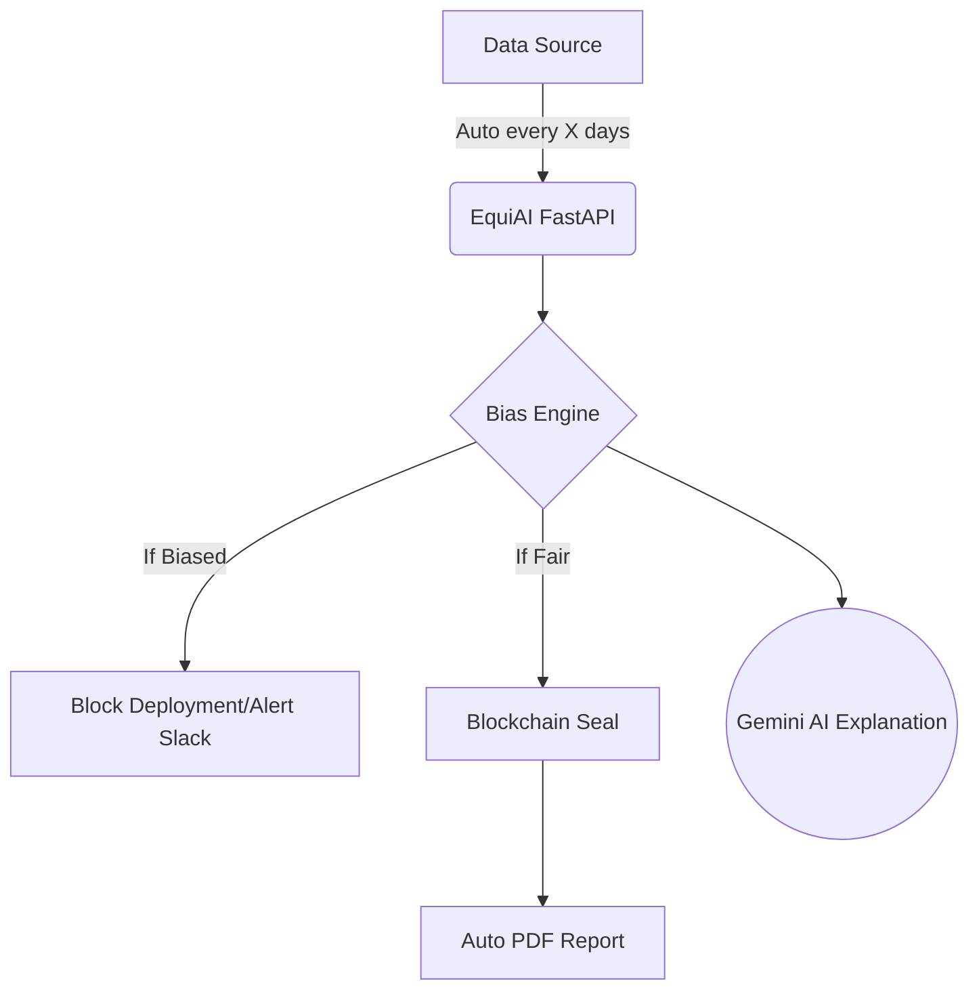

# EquiAI — Global AI Fairness & Accountability Standard

> Wherever AI makes decisions about human lives — hiring in Mumbai, loans in Lagos, admissions in São Paulo, healthcare in Berlin — EquiAI ensures those decisions are fair, explainable, and legally documented under local law. We're building the global standard for AI accountability.

---

## 🚀 Quick Start

### Step 1 — Backend Setup

Open a terminal in the `backend/` directory:

```bash
# Create virtual environment
python -m venv venv

# Activate it (Windows)
venv\Scripts\activate

# Install dependencies
pip install -r requirements.txt
```

### Step 2 — Configure Gemini API Key

Edit `backend/.env`:
```
GEMINI_API_KEY=your_actual_gemini_api_key_here
```
> Get a free key at: https://aistudio.google.com/app/apikey

### Step 3 — Start Backend

```bash
# From backend/ directory (with venv active)
uvicorn main:app --host 0.0.0.0 --port 8000 --reload
```

Backend API: http://localhost:8000  
API Docs:    http://localhost:8000/docs

### Step 4 — Start Frontend

Open a **second terminal** in the `frontend/` directory:

```bash
python -m http.server 5500
```

Then open: **http://localhost:5500**

> **Alternatively**: Open `frontend/index.html` directly in a browser — but some browsers block local API calls, so using the HTTP server is recommended.

---

## 📁 Project Structure

```
Solution challenge/
├── backend/
│   ├── main.py              # FastAPI app (bias engine + AI + blockchain)
│   ├── requirements.txt     # Python dependencies
│   ├── .env                 # Your API keys (DO NOT COMMIT)
│   └── .env.example         # Template
├── frontend/
│   ├── index.html           # Main app page
│   ├── style.css            # Premium dark UI styles
│   └── app.js               # Client logic + Chart.js
├── setup_backend.bat        # One-click backend setup (Windows)
├── start_backend.bat        # One-click backend start (Windows)
├── start_frontend.bat       # One-click frontend serve (Windows)
└── README.md
```

---

## 🧠 Features

| Feature | Description |
|--------|-------------|
| **CSV Upload** | Drag & drop CSV, auto-detects demographic & decision columns |
| **Bias Detection** | Disparate Impact Ratio per group, 80% rule enforcement |
| **Bias Score** | 0–100 score with 🟢 Fair / 🟡 Warning / 🔴 Biased indicators |
| **AI Explanation** | Google Gemini explains bias causes & recommends fixes |
| **Interactive Charts** | Bar charts for selection rates and DI ratios (Chart.js) |
| **PDF Export** | Full formatted audit report download |
| **JSON Export** | Machine-readable audit data |
| **Blockchain Log** | SHA-256 linked audit chain — tamper-proof audit trail |

---

## 📊 How Bias is Calculated

1. **Selection Rate** per group = selected / total in group  
2. **Disparate Impact Ratio** = minority_rate / majority_rate  
3. **80% Rule**: If DI < 0.8 → **BIASED** (legal EEOC standard)  
4. **Bias Score (0–100)**:
   - ≥0.8 DI → Score 0–20 (Fair range)
   - 0.5–0.8 DI → Score 20–70 (Warning/Biased)
   - <0.5 DI → Score 70–100 (Severely Biased)

---

## 🔗 Blockchain Audit Chain

Every analysis stores a block containing:
- Dataset filename, bias score, bias level
- SHA-256 hash linked to previous block
- Timestamp (UTC)

This ensures audit results **cannot be edited or deleted** — perfect for compliance.

---

## 📋 Sample Test Dataset

```csv
Name,Gender,Race,Selected
Alice,Female,Asian,No
Bob,Male,White,Yes
Carol,Female,Black,No
David,Male,White,Yes
Eva,Female,Hispanic,No
Frank,Male,Asian,Yes
Grace,Female,White,No
Henry,Male,Black,Yes
```

Click **"Load Sample Data"** on the homepage to use this instantly.

## 🤖 Enterprise Automation Pipeline

EquiAI supports end-to-end fairness automation across your entire stack:

| Integration | Description |
|---|---|
| **Scheduled Scanning** | Connect to HR/DB systems to run automated CSV audits via cron jobs. |
| **CI/CD "Fairness Gate"** | GitHub Actions blocks ML model deployments if the bias score drops below 80. |
| **API Webhooks** | Submit real-time decisions to `/api/webhook/evaluate` for immediate drift alerts. |
| **Automated Reporting** | Auto-generates PDF reports and seals them on the blockchain monthly. |
| **Always-On Monitoring** | Live dashboard tracking fairness scores over time, triggering Slack/Email alerts. |



---

## 🌍 Global Compliance Engine

EquiAI is the world's first **multi-jurisdiction** AI fairness protocol. Instead of hardcoding a single US law, simply select where your AI operates:

| Region | Law / Standard | Fairness Test Threshold |
|--------|----------------|-------------------------|
| 🇺🇸 USA | EEOC 4/5ths Rule | 80% Requirement |
| 🇪🇺 EU  | EU AI Act 2024   | 85% Conformity Test |
| 🇬🇧 UK  | Equality Act 2010| 82% Proportionality |
| 🇮🇳 IND | Const. Article 15| 80% Non-Discrimination |

### 🇺🇳 UN SDG Alignment built-in:
Every audit automatically maps flagged bias metrics directly to **UN Sustainable Development Goals**:
* Gender bias → **SDG 5** (Gender Equality) ⚠️
* Race bias → **SDG 10** (Reduced Inequalities) ⚠️
* Systemic bias → **SDG 16** (Strong Institutions) ⚠️

By linking AI fairness directly to SDGs, we make algorithmic ethics universally understood across 193 nations. Plus, our **Multi-language AI Explainer** automatically translates deep analytical findings into Spanish, Hindi, French, and more.

---

## 🛠 Tech Stack

- **Frontend**: HTML5 + Vanilla CSS + JavaScript + Chart.js  
- **Backend**: Python + FastAPI + Pandas + NumPy  
- **AI**: Google Gemini 1.5 Flash  
- **PDF**: fpdf2  
- **Blockchain**: Custom SHA-256 linked chain (in-memory)

---

## ⚖️ Legal Standards

EquiAI implements the **EEOC 4/5ths (80%) Rule** — the standard used by the US Equal Employment Opportunity Commission to detect adverse impact in hiring/selection processes.

A disparate impact ratio below 0.8 indicates potential discrimination under:
- US Title VII of the Civil Rights Act  
- UK Equality Act 2010  
- EU AI Act (high-risk AI systems)
